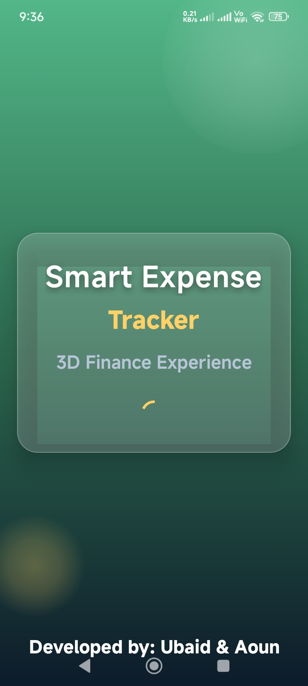
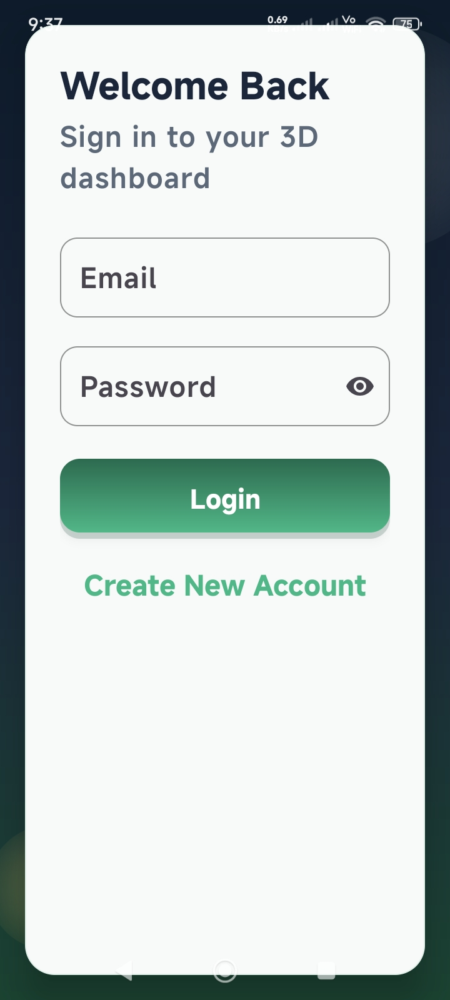
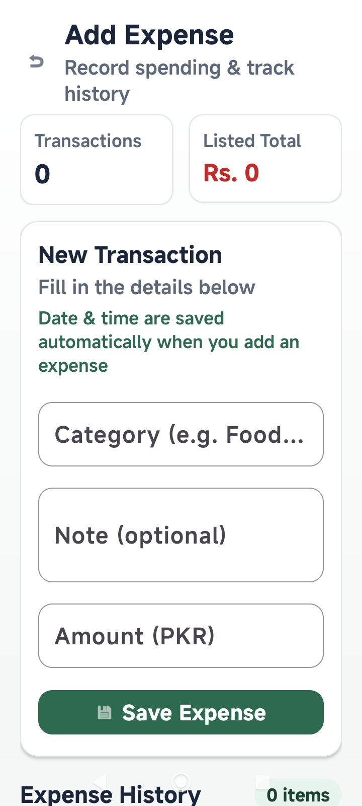

# SmartExpense Tracker

> A secure and user-friendly Android application for tracking daily expenses, managing budgets, and improving financial habits — built for everyone.

---

## About the App

SmartExpense Tracker is an Android-based mobile application developed using **Java**, **Android Studio**, and **Firebase**. It allows any user — professionals, homemakers, or individuals — to record, monitor, and analyze their daily expenses from their mobile device.

- **What the app is about:** A personal finance tracker that logs expenses by category, amount, and date
- **Who can use this app:** Everyone — general public, working professionals, students, and families
- **What problem it solves:** Most people do not track their spending, which leads to poor budgeting and overspending
- **What main features it provides:** Expense logging, real-time dashboard, history tracking, Firebase cloud sync, and secure login

---

## App Screenshots

| Splash Screen | Login Screen | Dashboard |
|---------------|--------------|-----------|
|  |  |  |

| Register Screen | Add Expense Screen |
|-----------------|--------------------|
|  |  |

---

## Features

- ✅ User Registration and Login
- ✅ Firebase Authentication (secure login)
- ✅ Add Expense with category, amount, and date
- ✅ Expense History Tracking
- ✅ Total Expense Calculation (auto)
- ✅ Real-time Cloud Data Sync
- ✅ User-Friendly Dashboard
- ✅ Secure Data Storage via Firebase

---

## Technologies Used

- Java (Programming Language)
- Android Studio (Development Environment)
- XML (UI Design)
- Firebase Authentication (User Login)
- Firebase Realtime Database (Cloud Storage)
- Gradle (Build System)

---

## APK Download

Download and install the latest APK directly on your Android device:

[⬇️ Download APK](apk/SmartExpenseTracker.apk)

---

## How to Install the APK

1. Download the APK file from the link above.
2. Open the APK file on your Android mobile phone.
3. If prompted, allow installation from **unknown sources** in Settings → Security.
4. Tap **Install** and wait for the installation to complete.
5. Open **SmartExpense Tracker** and register your account.

---

## How to Run the Project

1. Clone or download this repository.
   ```bash
   git clone https://github.com/YourUsername/SmartExpenseTracker.git
   ```
2. Open the project in **Android Studio**.
3. Sync Gradle files (click **Sync Now** if prompted).
4. Connect Firebase:
   - Go to [Firebase Console](https://console.firebase.google.com/)
   - Create a new project and download `google-services.json`
   - Place it inside the `/app` folder
5. Run the app on an emulator or a physical Android device.

---

## Demo Video

> Add a short demo video link here once available.

[▶️ Watch Demo Video](demo-video-link)

---

## Privacy Policy

This app collects user email and expense data, stored securely on Firebase. We do not share or sell any user data to third parties. Users can delete their account and data at any time.

[📄 View Full Privacy Policy](docs/privacy_policy.pdf)

---

## Future Enhancements

- 📊 Expense charts and graphs
- 📅 Monthly budget planning
- 📄 PDF report generation
- 🌙 Dark mode feature
- 🤖 AI-based expense analysis
- 🔔 Spending notifications
- 👨‍💼 Admin panel

---

## Developed By

**Ubaid Ur Rehman & Aown Abbas**
Class / Semester: [Your Semester]
Department of Computer Science
University of Layyah

**Submitted To:** Ma'am Nabiha Komal
**Course:** Mobile Application Development

GitHub: [Your GitHub Profile Link](https://github.com/YourUsername)
LinkedIn: [Your LinkedIn Profile Link](https://linkedin.com/in/YourProfile)

---

## Repository Structure

```
SmartExpenseTracker/
├── app/
│   └── (Complete Android project source code)
├── screenshots/
│   ├── splash_screen.png
│   ├── login_screen.png
│   ├── signup_screen.png
│   ├── dashboard_screen.png
│   └── feature_screen.png
├── apk/
│   └── SmartExpenseTracker.apk
├── docs/
│   ├── privacy_policy.pdf
│   └── user_manual.pdf
├── README.md
├── LICENSE
├── .gitignore
├── build.gradle
└── settings.gradle
```

---

> *SmartExpense Tracker — Take control of your money, one expense at a time.*
